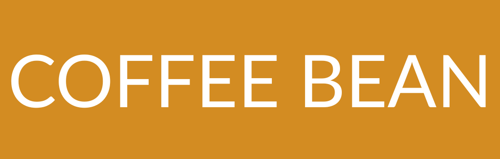

# ☕ Coffee Bean

A landing page template for a cafe that sells premium coffee and pastries as well as roasted beans.

## Features

- Responsive design across all screen sizes

- Fully functional navigation with smooth scrolling

- Clean, semantic, accessible markup

- Pixel-perfect design

- Soothing reveal and scroll animations

## Running locally

```bash
git clone https://github.com/blue-crown-dev/coffeebean.git
cd coffeebean
```

- Open the `index.html`file in your browser to see.

## Deployment

The site is deployed live at [this link](https://beanscoffee.netlify.app)

## Built with

- HTML
- CSS
- JavaScript
- Box icons
- Scroll reveal.js

## Authors

Syed Umair Ali - _Built the project_ - @SyedUmairCodes

## License

This project is licensed with an MIT license.
